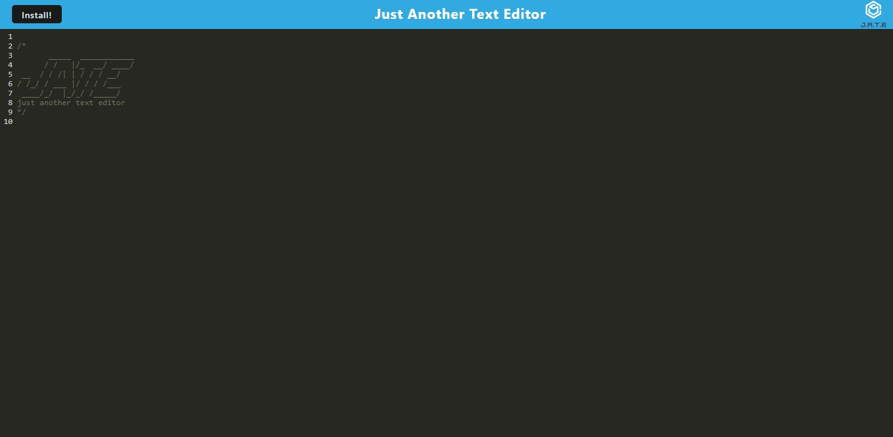

# PWA-Text-Editor

This is is JATE (just-another-text-editor). This text editor allows a user to write detailed script, and anyother text, it will save to local storage so users can see it whenver they'd like. Users can also click install (on the top left) and the app will be installed onto their desktop!

## Usage

To use, write on the text lines, and whenever you hit enter, the lines will be saved.

## Test

Write some text, test it out, install it onto your desktop

## Contributing/Contact

To submit bug reports, feature requests, or pull requests, please email me at hannibr26@gmail.com, or visit my GitHub page: BrockHanni(https://github.com/BrockHanni)

## License

Licenses used: N/A

## Deployment

https://text-editor-hanni-df42d79d9f8b.herokuapp.com/

## Screenshots

## Table of Contents
- [Usage](#usage)
- [Test](#test)
- [Contributing/Contact](#contributing/Contact)
- [License](#license)
- [Deployment](#deployment)
- [Screenshots](#screenshots)
- [Table of Contents](#table-of-contents)
